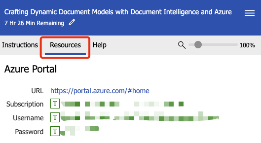

---
hide:
  - toc
---

# Provision Azure services

The following services will be provisioned in the lab Azure subscription:

1. [Azure AI Document Intelligence](https://azure.microsoft.com/products/ai-services/ai-document-intelligence?WT.mc_id=aiml-77396-cxa).
1. [Azure Cosmos DB](https://learn.microsoft.com/azure/cosmos-db/introduction?WT.mc_id=aiml-77396-cxa).
1. [Azure Static Web Apps](https://azure.microsoft.com/services/app-service/static/?WT.mc_id=aiml-77396-cxa).

## Open the workshop with VS Code

1. If you are completing this workshop at BUILD, the workshop assets are located in the **C:\Workshop\azure-doc-intelligence-dynamic-models-patient** folder.
2. Open the workshop folder in VS Code (File -> Open Folder), or from a terminal window, by running the following command.

    ```
    cd \Workshop\azure-doc-intelligence-dynamic-models-patient
    code .
    ```

## Open a terminal window in VS Code

From VS Code, select <kbd>Ctrl+Shift+`</kbd> to open a new terminal window.

## Create the Azure Patient Registration Services

From the terminal window, run the following commands to create the Azure Patient Registration Services.

1. Authenticate to Azure. You'll be asked for the Azure **Username** and **Password**. Switch to the **Resources** tab in the lab environment to get the credentials. After you've authenticated, switch back to the Instructions tab.

    

    Run the following command to authenticate to Azure.

    ```
    azd auth login
    ```


    
    Enter the username and password you used to log in to the Azure portal.

1. Initialize your Azure environment with the following command.

    You'll be asked to create an environment name. For this workshop, the environment name must be globally unique. Create a unique environment name by appending a random six digital number after **contoso-health-app-NNNNNN**, for example, contoso-health-app-318721. But don't use the example name, use your own.

    ```
    azd init
    ```

1. Deploy the Azure services with the following command.

    ```
    azd up
    ```

1. Select a region (e.g: **eastus**).
1. Select your subscription.

    !!! note

        It will take approximately 5 minutes to deploy the Azure services. So, now is a great time to read the next sections of the workshop documentation while you wait for the services to deploy.

1. The output from the `azd up` command will look like the following.

    ```text
    Packaging services (azd package)

    (✓) Done: Packaging service api
    - Package Output: /tmp/azddeploy3376479742.zip
    (✓) Done: Packaging service web
    - Package Output: dist

    Provisioning Azure resources (azd provision)
    Provisioning Azure resources can take some time

    (✓) Done: Resource group: rg-contoso-health-app-767678
    (✓) Done: Azure AI Document Intelligence: form-recognizer-r2qoh4og4cf6a
    (✓) Done: Storage account: storager2qoh4og4cf6a
    (✓) Done: Azure Cosmos DB: cosmos-r2qoh4og4cf6a
    (✓) Done: Application Insights: api-r2qoh4og4cf6a
    (✓) Done: App Service plan: api-r2qoh4og4cf6a
    (✓) Done: Static Web App: swa-r2qoh4og4cf6a

    Deploying services (azd deploy)

    (✓) Done: Deploying service api
    - Endpoint: https://api-r2qoh4og4cf6a.azurewebsites.net/

    (✓) Done: Deploying service web
    - Endpoint: https://polite-coast-0a3c12c1e.3.azurestaticapps.net
    ```

1. Make a note of your `Resource group` and `Storage account` names, as you'll need them in the next section of the workshop.

    ```
    Resource group: rg-contoso-health-app-NNNNNN
    Storage account: storagexxxxxxxxxxx
    ```

1. Leave VS Code open, as you'll need it in the next section of the workshop.
