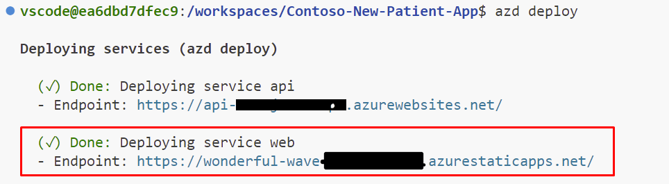

---
hide:
  - toc
---

# Integrate Azure AI Document Intelligence

In this section, we're going integrate the Document Intelligence Model with our patient web app to extract the patient's information from an uploaded image.

## Updating the Azure Function

1. Switch back to VS Code, you should still have the **contoso_new_patient_app** open in VS Code.
1. Open the **UploadFile.cs** file, located at **src/api/NewPatient/UploadFile.cs**.
1. Scroll down to the **// TODO: Call Azure AI Document Intelligence** section.
1. Replace the **// TODO comment and throw** statement with the following code

    ```csharp

    string? endpoint = Environment.GetEnvironmentVariable("FORM_RECOGNIZER_ENDPOINT");
    string? apiKey = Environment.GetEnvironmentVariable("FORM_RECOGNIZER_API_KEY");
    string? modelId = Environment.GetEnvironmentVariable("FORM_RECOGNIZER_MODEL_ID");

    if (string.IsNullOrEmpty(endpoint) || string.IsNullOrEmpty(apiKey) || string.IsNullOrEmpty(modelId))
    {
        throw new InvalidOperationException("Missing environment variables");
    }

    var credential = new AzureKeyCredential(apiKey);
    var client = new DocumentAnalysisClient(new Uri(endpoint), credential);

    AnalyzeDocumentOperation operation = await client.AnalyzeDocumentAsync(WaitUntil.Completed, modelId, file.OpenReadStream());
    AnalyzeResult result = operation.Value;

    var outputs = new Dictionary<string, (string, float?)>();

    foreach (AnalyzedDocument document in result.Documents)
    {
        foreach ((string fieldName, DocumentField field) in document.Fields)
        {
            outputs.Add(fieldName, (field.Content, field.Confidence));
        }
    }

    return outputs;

    ```

1. You must **Save** the file.

<details>
<summary>What is this code doing?</summary>

Let's take some time to understand what this code is doing by breaking it down piece by piece.

```csharp
string? endpoint = Environment.GetEnvironmentVariable("FORM_RECOGNIZER_ENDPOINT");
string? apiKey = Environment.GetEnvironmentVariable("FORM_RECOGNIZER_API_KEY");
string? modelId = Environment.GetEnvironmentVariable("FORM_RECOGNIZER_MODEL_ID");

if (string.IsNullOrEmpty(endpoint) || string.IsNullOrEmpty(apiKey) || string.IsNullOrEmpty(modelId))
{
    throw new InvalidOperationException("Missing environment variables");
}
```

This first piece of code is retrieving the environment variables that contain the keys and other secret information for Azure AI Document Intelligence, avoiding us from hard-coding them into the code. We've also got some **null** checking, to ensure that we have set the values.

```csharp
var credential = new AzureKeyCredential(apiKey);
var client = new DocumentAnalysisClient(new Uri(endpoint), credential);
```

Here, we're creating the connection to Document Intelligence using the endpoint and API key.

```csharp
AnalyzeDocumentOperation operation = await client.AnalyzeDocumentAsync(WaitUntil.Completed, modelId, file.OpenReadStream());
AnalyzeResult result = operation.Value;

var outputs = new Dictionary<string, (string, float?)>();

foreach (AnalyzedDocument document in result.Documents)
{
    foreach ((string fieldName, DocumentField field) in document.Fields)
    {
        outputs.Add(fieldName, (field.Content, field.Confidence));
    }
}

return outputs;
```

Lastly, we'll call Azure AI Document Intelligence, telling it which image we want to analyze and what trained model to use for that. When the result comes back, we'll loop through the fields that were found and return them as a dictionary, which will later be stored in Cosmos DB.

</details>

## Deploy to Azure

Deploy the app to Azure Static Web Apps with the Azure Developer CLI.

1. From VS Code, select <kbd>Ctrl+Shift+`</kbd> to open a new terminal.
1. From the terminal, run the following command to start the function app. This command takes about one minute to deploy the updated function to Azure.

   ```Shell

   azd deploy
   
   ```

## Open the patient registration app in your browser

1. From your browser, open the patient registration app at the **Web Service** URL displayed in the deployment logs.

   

2. Save the patient registration app URL for use in the next section.
