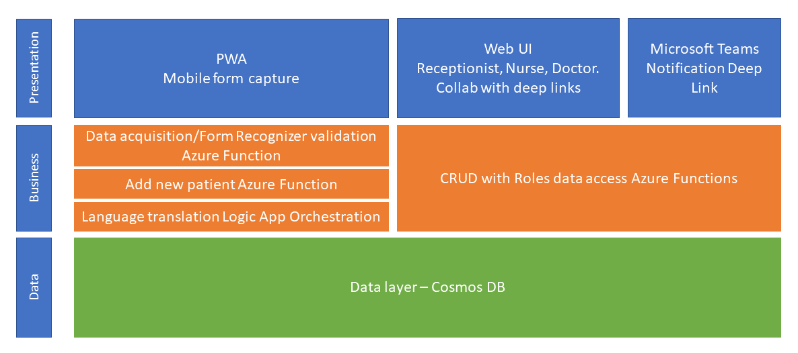

---
hide:
  - toc
---

# Workshop Introduction

Most of the forms we complete nowadays are online but there are still times when we need to complete paper-based forms. There are plenty of examples, for this workshop, we've chosen patient registration for a doctor's surgery as it's something we've all had to do at some point.

## Workshop navigation

You can navigate the workshop using the table of contents on the left-hand side of the page and the next and previous links at the bottom of each page.

## Workshop problem statement

This solution aims to address data issues that creep in with paper-based systems, plus the overhead associated with entering the new patient information into the surgery system.

For this doctor's surgery, patient registration is still a paper-based process and will continue to be so for the foreseeable future. The surgery wants to improve the patient experience by automating the paper-based registration process.

## Workshop goals

The goal of this workshop is for you to learn how to infuse AI technologies into a web based patient registration system.

1. The workshop solution is a simplified version of a real-world scenario, simple enough to be completed in a workshop but complex enough to show the power of AI technologies.
1. The workshop provides a step-by-step guide, taking you through the process of deploying the solution to Azure. You'll learn a little about Azure Static Web Apps, Azure Functions, Azure AI Services, Azure Storage, and Azure Cosmos DB.

## Introduction to Azure AI Document Intelligence

The solution will build on Azure AI Document Intelligence. Azure AI Document Intelligence is a service that uses machine learning to extract text and table data from form documents. You can train custom models to extract data specific to your forms or use the prebuilt models to extract common fields from receipts, invoices, and business cards.

## Workshop Personas

|  Persona |   | |
|---|---|---|
| Surgery admin: Drew |  Drew's role is to ensure new patients register in the surgery system. Drew also verifies new patient data before committing to the patient data in the surgery system. |  |
| Nurse: Alex | Alex uses new patient registration to understand any existing allergies or medicine reactions. |  |
| Doctor: Anthony |  Anthony uses new patient registration to understand any existing allergies or medicine reactions. |  |

## Workshop outline

The following is an outline of the workshop:

1. Learn about and create the Azure services for the app.
1. Train a custom Azure AI Document Intelligence model.
1. Create a web app that integrates with Azure AI Document Intelligence.
1. Define application roles that map to the workshop roles.
1. Implement app functions to support surgery admin, nurse, and doctor roles.

## Solution overview

The following outlines the process of the solution:

1. A new patient completes the patient registration form.
1. The patient then uploads the form to the web app.
1. The web app uses Document Intelligence to extract the data from the form.
1. The app returns the extracted data to the patient.
1. The patient submits the verified new data.
1. The surgery admin verifies registration and adds it to the doctor's surgery system.
1. Data is stored in the surgery system.
<!-- 1. Document data is analyzed and translated. -->
1. New patient registration records are available to the surgery's nurse and doctor.

<!-- ## Architecture

 -->
